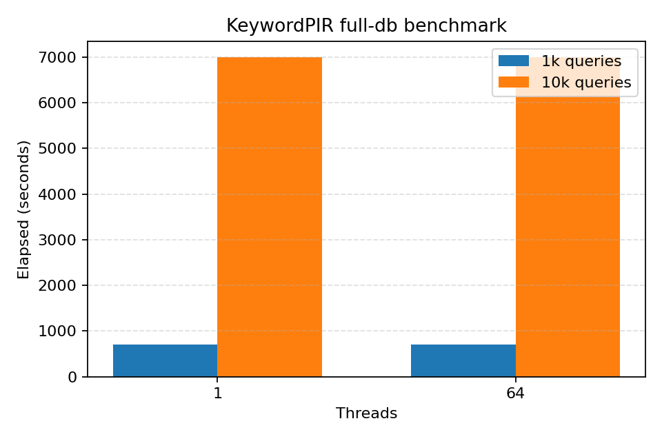

# RMS24 + KeywordPIR Full-DB Benchmark Report (2026-02-01)

## Summary

We benchmarked RMS24 and KeywordPIR against the full mainnet v3 dataset on hsiao. RMS24 completed 1k and 10k query runs at 1 and 4 threads, while KeywordPIR ran at 1 and 64 threads. Results show no meaningful scaling from 1 to 4 threads (RMS24) or 1 to 64 threads (KeywordPIR) and very similar timings between RMS24 and KeywordPIR, suggesting a shared bottleneck (likely single-threaded portions, server-side compute, or RPC/IO).

## Environment

- Host: hsiao (Linux)
- CPU threads: 64 (from `nproc`)
- Git rev: `30a585f278b303b906d86f5cc19043d63d0ae55e`
- Server: `127.0.0.1:4000`
- Entry size: 40
- Lambda: 80
- Seed: 42
- Coverage index: 0
- State cache: `/data/rms24/cache/hints_full_entry40_lambda80_seed42.bin`

## Data

- Dataset: full mainnet v3
- Source: `https://pir.53627.org/mainnet-pir-data-v3`
- Files used: `database.bin`, `account-mapping.bin`, `storage-mapping.bin`, `code_store.bin`, `manifest.json`, `metadata.json`
- Data root: `/data/rms24/full`

## Method

- Ran `scripts/bench_hsiao.sh` on hsiao.
- Modes: `rms24`, `keywordpir`.
- Queries: 1,000 and 10,000.
- Threads: RMS24 used 1 and 4; KeywordPIR used 1 and 64.
- State cache enabled (precomputed hints).
- Each run produced `summary.csv`, `server.jsonl`, `client.jsonl`, `sha256.txt`.

## Results

### RMS24 (run_id: 20260131_175636_30a585f)

| threads | queries | elapsed_ms |
| --- | --- | --- |
| 1 | 1,000 | 697,730 |
| 1 | 10,000 | 7,006,774 |
| 4 | 1,000 | 697,894 |
| 4 | 10,000 | 7,010,504 |

### KeywordPIR (run_id: 20260201_063431_30a585f)

| threads | queries | elapsed_ms |
| --- | --- | --- |
| 1 | 1,000 | 697,962 |
| 1 | 10,000 | 6,992,876 |
| 64 | 1,000 | 698,031 |
| 64 | 10,000 | 6,995,703 |

## Charts

### Sample Query Size (single query dump)

- `/tmp/query.bin`: 171,320 bytes
- gzip: 100,307 bytes
- zstd: 105,973 bytes

(Note: this was a single query dump from hsiao; the mode used for the dump was not recorded.)

## What We Learned

- No observable throughput improvement from 1 thread to 64 threads in KeywordPIR. RMS24 also showed no speedup from 1 to 4 threads.
- RMS24 and KeywordPIR timings are very close for the same dataset and query counts.
- The state cache is being used (shared hints file), so hint generation is not the dominant runtime in these runs.
- Query payloads are ~171 KB uncompressed; gzip yields ~41% reduction, zstd ~38%.

## Next Steps

1. Identify the bottleneck causing no scaling:
   - Profile client and server CPU usage during runs.
   - Confirm whether server or client is effectively single-threaded in the hot path.
   - Add per-phase timing (query gen, network, server compute, decode).
2. Repeat with explicit thread controls:
   - Add 1, 8, 32, 64 to confirm scaling curve (or lack of it).
   - Verify thread flags actually affect worker pools.
3. Validate network contribution:
   - Run on loopback vs remote; compare to isolate network overhead.
   - Capture and log per-query RTT if possible.
4. Investigate query size reduction:
   - Evaluate compression end-to-end; measure latency impact of compress/decompress.
5. Expand report coverage:
   - Add slice dataset baseline for sanity check.
   - Capture system load, memory usage, and cache hit/miss stats in report.

## Artifacts

- RMS24 run: `/data/rms24/runs/20260131_175636_30a585f`
- KeywordPIR run: `/data/rms24/runs/20260201_063431_30a585f`
- Sample query: `/tmp/query.bin`
